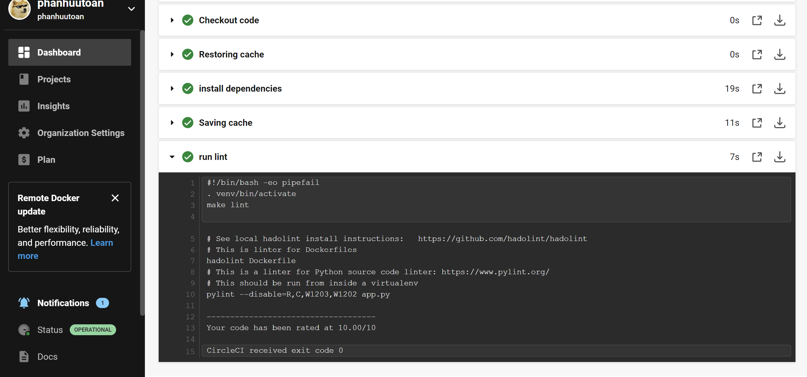

# My Udacity course 4 final project

## How to deploy docker
1. Go to run_docker.sh and change dockerpath base on your credentials
2. run run_docker.sh to build and run docker file

## Push to dockerhub
1. Go to upload_docker.sh to change **dockerpath** and **password file**
2. run it to upload to dockerhub with your tag

## Deploy k8s
1. Go to run_kubernetes.sh to change dockerpath
2. Run it.

## Logs files
You can find all logs file related to this PROJECT at logs folder

## Lint passed in circleCI 
